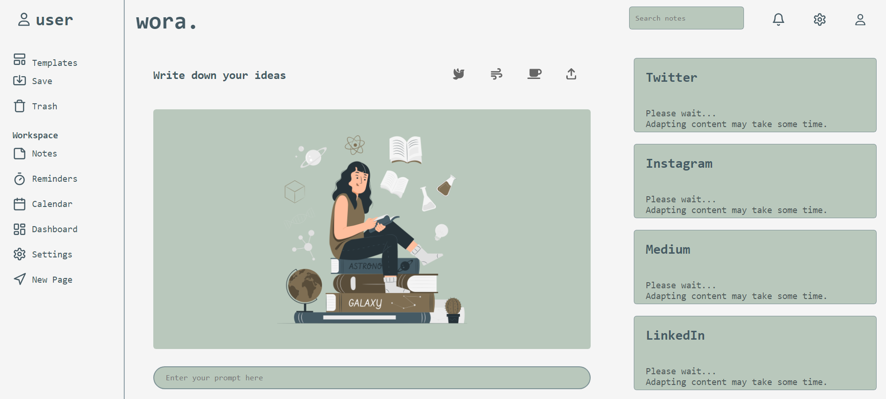
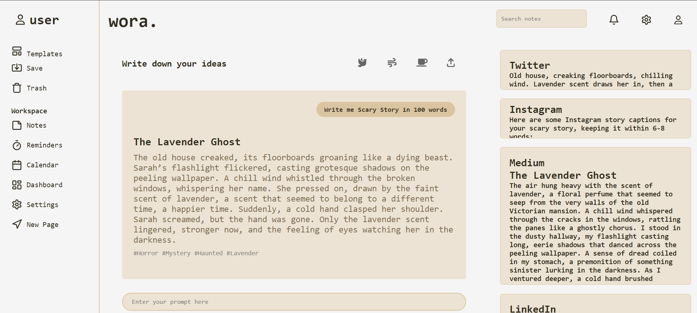
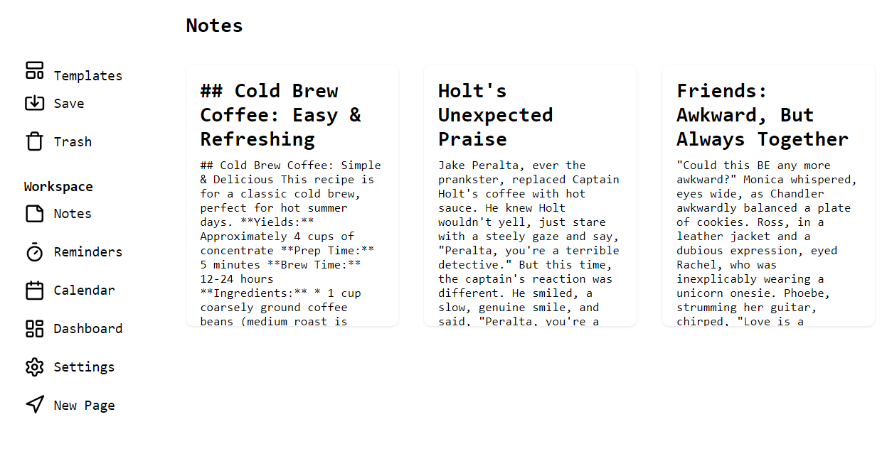

# Wora
**Write Once Run Anywhere** - A Content Adaptation App using Google Cloud's Vertex AI.

## Overview
Wora is designed for content creators and students, enabling them to generate, edit, and adapt their content for various platforms with a single click. It simplifies the content creation process and provides tools for personalizing and enhancing the content.

## Features
- **Prompt Generation**: Input a prompt and generate content using Google Cloud's Vertex AI.
- **Content Editing and Adaptation**: Edit and adapt the generated content for specific platforms.
- **Email Sending**: Send emails using Nodemailer.
- **User Authentication**: Sign up and sign in functionality with cookie and CORS support.
- **Themes**: Choose between Coffee and Sage themes for a personalized visual aesthetic.
- **Sound Effects**: Listen to Rain, Cafe, and Nature sounds while creating content.
- **Content Saving and Viewing**: Save your content and view it anytime.
- **Animations**: Enjoy smooth animations for a polished user experience.
- **Hashtag and Title Suggestions**: Get relevant hashtags and titles automatically.
- **PDF Export**: Export your content as a PDF when needed.

## Tech Stack
- **Front End**: HTML, CSS, JavaScript, React
- **Back End**: Node.js, Express, MongoDB, Google Cloud's Vertex AI

## Screenshots
### Main Interface

*The main interface of Wora where users can generate and edit content.*

### Content Adaptation

*Adapting content for different platforms.*

### Saved Notes

*Choose between Coffee, Sage or Snow themes for a personalized experience.*

## Future Updates
### 1. Smart Contracts for Premium Features
- Implement smart contracts to manage premium subscriptions and features.
- Utilize blockchain technology to ensure secure and transparent transactions.

### 2. Improved Design
- Enhance the UI/UX for a more intuitive and visually appealing experience.
- Focus on user-friendly navigation and aesthetic improvements.

### 3. OAuth Authentication
- Integrate OAuth for seamless and secure user authentication.
- Support multiple OAuth providers (e.g., Google, Facebook, GitHub) for flexible login options.

### 4. Reminders and Calendars
- Add functionalities for setting reminders and managing calendars.
- Include options for notifications and alerts for important events and deadlines.

### 5. More Animations
- Introduce additional animations for a more dynamic and engaging user interface.
- Use animations to enhance user interactions and improve overall user experience.

